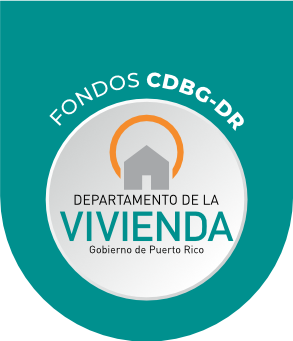
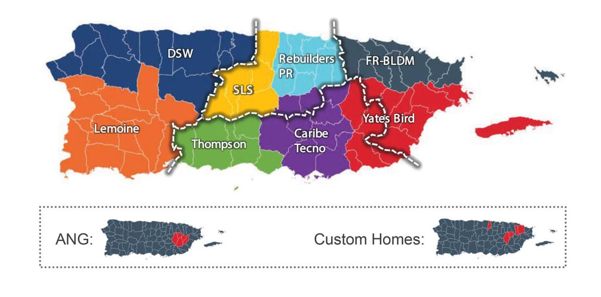
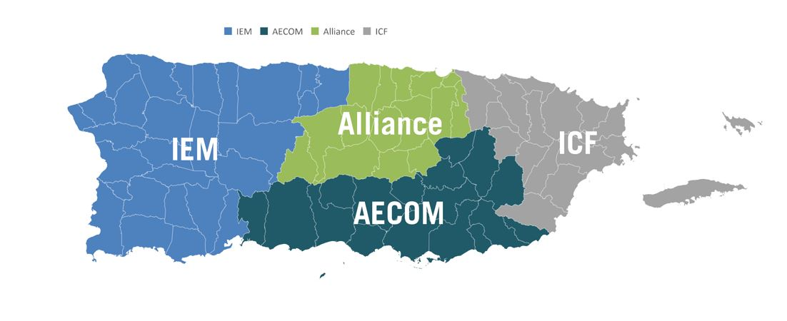

<p align="center">
  
</p>

  
<p align="center">This FondosCDBG-DR API provides allocation data from the United States Department of Housing and Urban Development (HUD), available when the President declares a major disaster and there are significant unmet needs for long-term recovery.</p>
<p align="center">
            
  
  
</p>


## 🚨 Project in premature state 🚨
Project started, and in development process. More information in the next days / weeks.


## 📜 API Documentation

### PackageManager.contracts()
Data related to the contracts that have materialized under the CDBG-DR Funds.

```json
[
  {
    "table": [
      {
        "nombre_de_contratista": "Action Service Corporation",
        "solicitado_por": "Departamento de la Vivienda (DV)",
        "fecha_de_ejecucion": "2019-11-21",
        "cantidad_total": "N/A",
        "descargar_doc": "https://cdbg-dr.pr.gov/download/action-service-corporation-2/"  
      },
      {
        "nombre_de_contratista": "Action Service Corporation",
        "solicitado_por": "Departamento de la Vivienda (DV)",
        "fecha_de_ejecucion": "2019-07-17",
        "cantidad_total": "$55,684.80",
        "descargar_doc": "https://cdbg-dr.pr.gov/download/action-service-corporation/"    
      },
      {
        "nombre_de_contratista": "Aecom Technical Services",
        "solicitado_por": "Departamento de la Vivienda (DV)",
        "fecha_de_ejecucion": "2019-07-16",
        "cantidad_total": "$22,384,943.00",
        "descargar_doc": "https://cdbg-dr.pr.gov/download/aecom-technical-services/"      
      },
      {
        "nombre_de_contratista": "Alliance for the Recovery of Puerto Rico",
        "solicitado_por": "Departamento de la Vivienda (DV)",
        "fecha_de_ejecucion": "2019-07-12",
        "cantidad_total": "$22,693,267.78",
        "descargar_doc": "https://cdbg-dr.pr.gov/download/alliance-for-the-recovery-of-puerto-rico/"
      },
      {
        "nombre_de_contratista": "ANG Construction Inc.",
        "solicitado_por": "Departamento de la Vivienda (DV)",
        "fecha_de_ejecucion": "2019-11-22",
        "cantidad_total": "$15,000,000.00",
        "descargar_doc": "https://cdbg-dr.pr.gov/download/ang-construction-inc/"
      },
      // .....
    ]
  }
]
```

# Contractors
The following data groups all contractors working for the CDBG-DR funds Repair, Reconstruction or Relocation (R3) Program.

## Construction Managers
### PackageManager.constructionManagers()
<p align="center">
  
</p>

```json
[
  {
    "table": [
      {
        "gerentes_de_construccion": "ANG",
        "nombre": "Dilia Gonzalez",
        "correo_electronico": "d.gonzalez@angpr.com",
        "numero_de_contacto": "787-439-7891",
        "sitio_web": "www.angpr.com"
      },
      {
        "gerentes_de_construccion": "Thompson",
        "nombre": "Bob Roberts",
        "correo_electronico": "broberts@thompsonind.com",
        "numero_de_contacto": "939-545-0527",
        "sitio_web": "www.thompsonind.com"
      },
      {
        "gerentes_de_construccion": "Yates-Bird",
        "nombre": "Recursos Humanos",
        "correo_electronico": "cdbg-info@yatesbirdllc.com",
        "numero_de_contacto": "228-271-3598",
        "sitio_web": "www.yatesbirdllc.com"
      },
      {
        "gerentes_de_construccion": "Lemoine",
        "nombre": "Recursos Humanos",
        "correo_electronico": "Careers@lemoinedr.com",
        "numero_de_contacto": "1-833-536-6463 (1-833-LEMOINE)",
        "sitio_web": "www.lemoinedr.com"
      },
      // .....
    ]
  }
]
```


## Program Managers
### PackageManager.programManagers()
<p align="center">
  
</p>

```json
[
  {
    "table": [
      {
        "gerentes_de_programas": "Alliance for PR",
        "nombre": "Recursos Humanos",
        "correo_electronico": "jobs@allianceforpr.com",
        "numero_de_contacto": "1-800-570-8218",
        "sitio_web": "www.allianceforpr.com"
      },
      {
        "gerentes_de_programas": "AECOM",
        "nombre": "Luis Torres",
        "correo_electronico": "luis.torres@teamaecompr.com",
        "numero_de_contacto": "787-705-4410",
        "sitio_web": "www.teamaecompr.com"
      },
      {
        "gerentes_de_programas": "ICF",
        "nombre": "Adriana Brockman",
        "correo_electronico": "Adriana.brockman@icf.com",
        "numero_de_contacto": "703-934-3000",
        "sitio_web": "www.icf.com/careers"
      },
      {
        "gerentes_de_programas": "IEM",
        "nombre": "Rafael Torres",
        "correo_electronico": "Rafael.Torres@iempr.net",
        "numero_de_contacto": "787-229-6262",
        "sitio_web": "www.iempr.net"
      }
    ]
  }
]
```


##  **Donations**
FondosCDBG-DR API is an open source project licensed by MIT with continuous development. If you want me to continue maintaining this library and you are interested in continuing to use it, you can help me with a monetary help in the following link:


- [One-time donation via PayPal.](https://paypal.me/chrismperezsantiago?locale.x=en_US)

<a href="https://www.buymeacoffee.com/chrismichael" target="_blank"></a>

These are projects that take a lot of effort and time to maintain. So with your help I will be more motivated to continue maintaining the FondosCDBG-DR API project.


## 💡 References
- *cdbg-dr.pr.gov 2020. (FondosCDBG-DR) Departamento de la Vivienda. [online] Available at: <https://cdbg-dr.pr.gov/> [Accessed 29 April 2020].*


## **:handshake: Contributing**

- Fork it!
- Create your feature branch: `git checkout -b my-new-feature`
- Commit your changes: `git commit -am 'Add some feature'`
- Push to the branch: `git push origin my-new-feature`
- Submit a pull request

---

### **:busts_in_silhouette: Credits**

- [Chris Michael](https://github.com/ChrisMichaelPerezSantiago) (Project Leader, and Developer)

---

### **:anger: Troubleshootings**

This is just a personal project created for study / demonstration purpose and to simplify my working life, it may or may
not be a good fit for your project(s).

---

### **:heart: Show your support**

Please :star: this repository if you like it or this project helped you!\
Feel free to open issues or submit pull-requests to help me improving my work.


---


### **:robot: Author**

_*Chris Michael*_

> You can follow me on
[github](https://github.com/ChrisMichaelPerezSantiago)&nbsp;&middot;&nbsp;[twitter](https://twitter.com/Chris5855M)

---

Copyright © 2020 [COVID19 Fondos CDBG-DR API](https://github.com/ChrisMichaelPerezSantiago/FondosCDBG-DR-api).
